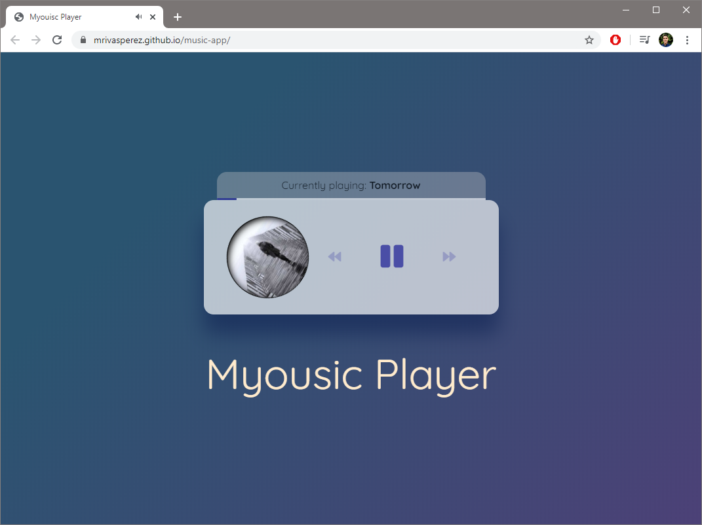

# Myousic Player: A beautiful music player template.
by mrivasperez

## About
[Myousic Player](https://mrivasperez.github.io/music-app/ "Live Demo") (Music-App) is a template people can use if they would like to add audio or music to their website or app. It is designed in a way that people can easily modify it by just dragging and dropping cover art and sound tracks, making sure that cover art and tracks that correlate with it have matching file names, and then update the JS array (@ line 16) with names.

## Screenshot

> A screenshot of Myousic Player playing the sample "Tomorrow" track.

## Built With
- HTML
- CSS
- Vanilla JS (ES6). 

## License
This project is licensed under the Unlicense. See the [LICENSE.md ](https://github.com/mrivasperez/music-app/blob/master/LICENSE.md "Link to license") file for details.

## Acknowledgments
- Music: https://www.bensound.com/royalty-free-music